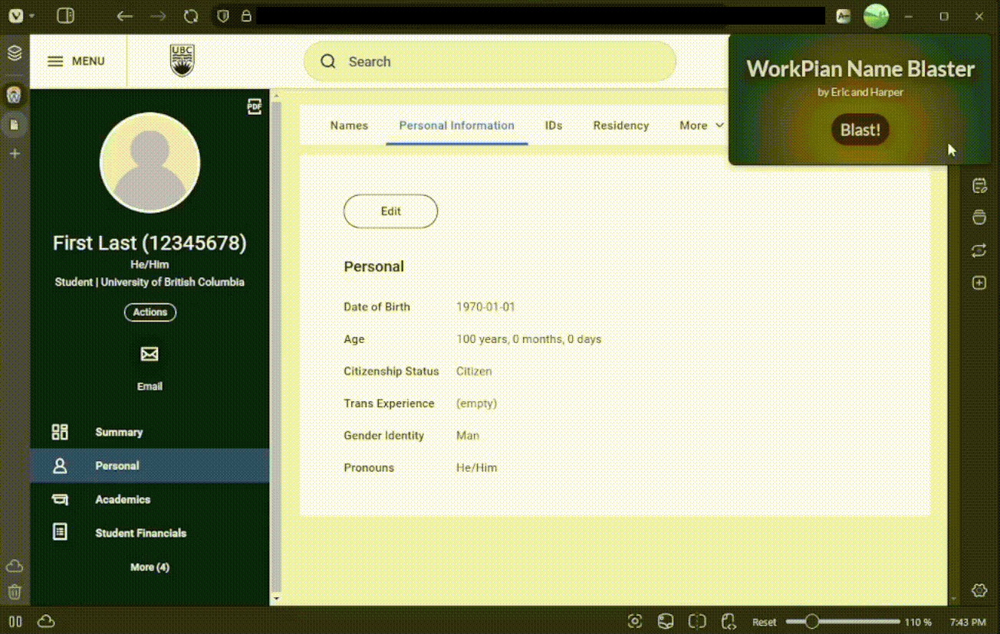

# Workpian Name Blaster
 
 

Workpian Name Blaster is a Chromium browser extension for censoring the most common instances of sensitive data found in UBC's Workday and Appian student information platforms. Built to speed up internal documentation processes.

## Installation

A compiled version of the extension is available in the [releases section](https://github.com/imkimdol/workpian-name-blaster/releases/tag/v1.0.0). To install, follow the instructions found in the release notes.